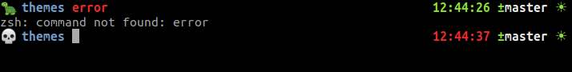

# traista

> Oh My Zsh theme

V2

## Setup

Clone: 

```sh
cd ~/.oh-my-zsh/custom/themes
git clone https://github.com/exaluc/traista
```

Change theme in .zshrc:

```sh
ZSH_THEME="traista/traista"
```

Or you can simply install with my [.dotfiles](https://github.com/exaluc/dotfiles) :

```sh
cd
git clone https://github.com/exaluc/dotfiles
cd dotfiles
zsh install.sh
```

Reload your terminal.

<!-- ## Screen

 -->


## Requirements

* zsh
* [Oh My ZSH!](https://ohmyz.sh/)


## TODO

- [x] readme.md
- [ ] space design in terminal Visual Studio Code
- [ ] anaconda prompt
- [ ] nodejs prompt
- [ ] ruby prompt

## Meta

Lucian – [@exaluc](https://twitter.com/exaluc)

Distributed under the MIT license. See ``LICENSE`` for more information.

[traistă](https://github.com/exaluc/traista)